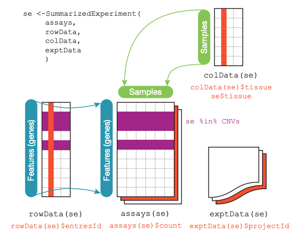

# Summarized Experiment

## Información


En la parte de **metadata** puede ir lo que uno quiera, es equivalente a un espacio extra para guardar información adicional del experimento.


## Ejemplo

```{r}
## Lets build our first SummarizedExperiment object
library("SummarizedExperiment")
```


```{r}

## Creamos los datos para nuestro objeto de tipo SummarizedExperiment
## para 200 genes a lo largo de 6 muestras

nrows <- 200
ncols <- 6
## Números al azar de cuentas
set.seed(20210223)
counts <- matrix(runif(nrows * ncols, 1, 1e4), nrows)
## Información de nuestros genes
rowRanges <- GRanges(
    rep(c("chr1", "chr2"), c(50, 150)),
    IRanges(floor(runif(200, 1e5, 1e6)), width = 100),
    strand = sample(c("+", "-"), 200, TRUE),
    feature_id = sprintf("ID%03d", 1:200)
)

# Información de los renglones
names(rowRanges) <- paste0("gene_", seq_len(length(rowRanges)))

## Información de nuestras muestras
colData <- DataFrame(
    Treatment = rep(c("ChIP", "Input"), 3),
    row.names = LETTERS[1:6]
)
## Juntamos ahora toda la información en un solo objeto de R
rse <- SummarizedExperiment(
    assays = SimpleList(counts = counts),
    rowRanges = rowRanges,
    colData = colData
)

## Exploremos el objeto resultante
rse
```


```{r}
## Número de genes y muestras
dim(rse)
```

```{r}
## IDs de nuestros genes y muestras
dimnames(rse)
```

```{r}
## Nombres de tablas de cuentas que tenemos (RPKM, CPM, counts, logcounts, etc)
assayNames(rse)
```

```{r}

```


```{r}
## El inicio de nuestra tabla de cuentas
head(assay(rse))
```

```{r}
## Información de los genes en un objeto de Bioconductor
rowRanges(rse)
```

```{r}
## Tabla con información de los genes
rowData(rse) # es idéntico a 'mcols(rowRanges(rse))'
```

```{r}
## Tabla con información de las muestras
colData(rse)
```

### Pregunta de Athena

```{r}
## Ver los "unique" levels (cromosomas)
seqlevels(rse)

## Tabla comprimida por repetición de cada level (chromosoma)
seqnames(rowRanges(rse))
```

## Ejercicio

```{r}
## Comando 1
rse[1:2, ]
head(assay(rse[1:2, ]))
```

El primer comando lo que hace es que mantiene fijo los renglones 1,2 los cuales equivalen al gen_1 y gen_2, proporcionando la información para todas las columnas.

En este caso podriamos pensarlo como la vista de todas las condiciones para los genes 1 y 2

```{r}
## Comando 2
rse[, c("A", "D", "F")]
head(assay(rse[, c("A", "D", "F")]))
```

Por otro lado el segundo comando se encarga de fijar especificamente las columnas  A,D,F para todos los renglones.

En este caso podemos interpretarlo como una visión de todos los genes para las muestras A,D,F, generando el subconjunto.

# iSEE

Sirve para la visualización de un objeto de summarized experiment

## Ejemplo

```{r}
## Explora el objeto rse de forma interactiva
library("iSEE")
```

```{r}
iSEE::iSEE(rse)
```

# SpatialLIBD

Esto genera un objeto SingleCell experiment

## Ejemplo

```{r}
## Descarguemos unos datos de spatialLIBD
sce_layer <- spatialLIBD::fetch_data("sce_layer")
```

```{r}
sce_layer
```

```{r}
iSEE::iSEE(sce_layer)
```

```{r}
sce_layer[c("ENSG00000168314", "ENSG00000183036", "ENSG00000197971"),]
```

```{r}
# Ubicamos los nombres de nuestros genes
print('COLDATA')
head(rowRanges(sce_layer[c("ENSG00000168314", "ENSG00000183036", "ENSG00000197971"),])$gene_search)
```

```{r}
# Ubicamos los nombres de nuestros genes
print('COLDATA')
head(rowRanges(sce_layer[c("ENSG00000168314", "ENSG00000183036", "ENSG00000197971"),])$gene_name)
```

```{r}
# creamos el objeto que contenga los 3 genes
sce_obj <- sce_layer[c("ENSG00000168314", "ENSG00000183036", "ENSG00000197971"),]
iSEE::iSEE(sce_layer)
```


https://www.shinyapps.io/
